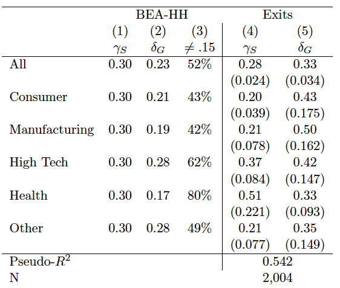

# Intangible capital: depreciation rates and stocks

This repository contains the parameter estimates for intangible capital accumulation and the estimated knowledge and organization capital stocks from Ewens, Peters and Wang (2024), "[Measuring Intangible Capital with Market Prices](https://osf.io/preprints/socarxiv/kvp2f/)." It also contains the code that builds the stocks from Compustat, so the stocks can be refreshed as Compustat updates.

**Update history**

* April 2019: updated the goodwill adjustment and fixed a bug in the estimation code. The parameter estimates changed.
* October 2023: fixed a small data error in the estimation sample. Small changes to the parameter estimates and stocks; no meaningful change to the relative performance of the paper's intangible stocks.
* September 2026: the stocks are now rebuilt from current Compustat with the October 2023 parameter estimates (unchanged) and refreshed as new fiscal years close in Compustat (a few times a year, since fiscal year-ends differ across firms). The construction code is in `pipeline/`. Coverage extends from fiscal 1975 through the latest reported fiscal year.

## Primer on capitalizing intangibles: the perpetual inventory model

See Sections 2 and 4 of [Ewens, Peters and Wang (2024)](https://osf.io/preprints/socarxiv/kvp2f/). Parameters of interest:

* : the depreciation rate of knowledge capital investment (i.e. R&D)
* : the depreciation rate of organization capital investment (i.e. SG&A)
* : the percent of SG&A spending that is treated as investment in organizational capital.

Each of these parameters is estimated for the [five Fama-French industries](http://mba.tuck.dartmouth.edu/pages/faculty/ken.french/Data_Library/det_5_ind_port.html).

## Parameter estimates

[The depreciation and investment parameters](capital_accum_parameters_2023.csv) (csv) can be merged onto any dataset of firm-time R&D and SG&A flows using SIC codes. The variables are

* `sic`: SIC code
* `knowDepr`: the estimate for the knowledge capital depreciation
* `organDepr`: the estimate for the organizational capital depreciation
* `gamma`: the estimate for the percentage of SG&A spending that is considered investment in organizational capital
* `industry5`: the major Fama-French industry the SIC belongs to. Ewens, Peters and Wang put `sic >= 8000 & sic <= 8099` in `industry5 == 1` and move some "high-tech" TV/radio providers into consumer ([classification scheme](industry5.do)).

Estimates (Oct. 2023) with bootstrapped standard errors:



## Stocks for Compustat firms

Current release: [`intangibleCapital_20260924.csv`](intangibleCapital_20260924.csv) or [`intangibleCapital_20260924.dta`](intangibleCapital_20260924.dta). One row per Compustat firm and fiscal year, 534,089 firm-years, 46,082 firms, fiscal years 1975 to 2026, built from Compustat as of June 30, 2026. Columns:

* `gvkey`: the Compustat unique identifier
* `fyear`: the fiscal year
* `orgCapital`: organization capital (net) using SG&A
* `knowCapital`: knowledge capital (net) using R&D
* `note`: blank when the stocks are computed from reported data. Otherwise one of: `assets missing; no stock computed` (Compustat has the firm-year but no reported assets, so the flows cannot be filled and the stock is left missing); `assets missing; R&D and SG&A interpolated` (flows interpolated from adjacent years); `stock missing because an earlier year had no flows`.

All dollars are nominal, in Compustat units (millions). The stocks are _net_ assets, not gross, so a year-on-year change is net investment. Every Compustat firm-year is kept; a missing stock is explained in `note` rather than dropped.

To load in Stata:

`use "https://github.com/michaelewens/Intangible-capital-stocks/raw/master/intangibleCapital_20260924.dta", clear`

or

`import delimited "https://github.com/michaelewens/Intangible-capital-stocks/raw/master/intangibleCapital_20260924.csv", clear`

In Python:

`pd.read_csv("https://github.com/michaelewens/Intangible-capital-stocks/raw/master/intangibleCapital_20260924.csv")`

The previous release, [`intangibleCapital_090123.dta`](intangibleCapital_090123.dta) (fiscal 1975 to 2019, September 2023), is kept for replication of work that used it.

### Historical stocks change between releases

Updates to Compustat (restated financials, revised header industry codes, added or re-dated
firm-years), to the deflator, and to the founding-year data can change a firm's historical stocks,
because each stock is built from the firm's whole history. Read [`STOCK_CHANGES.md`](STOCK_CHANGES.md)
for the size of the changes between the 2023 and 2026 releases, what drives them, and ten worked
examples.

### How the stocks are built

The industry-level parameter estimates are applied to each firm's full history of R&D and SG&A in Compustat with the perpetual inventory method. The initial stock at a firm's first Compustat year is imputed from its age (Ritter founding year where available) and the average growth of R&D and SG&A around the IPO. Missing R&D is set to zero from 1977 when assets are reported; missing SG&A is set to zero when assets are reported; remaining gaps are interpolated. Flows are deflated with the CPI for the accumulation and the stocks are converted back to nominal dollars. `pipeline/README.md` documents every step in order.

## Code to construct stocks

`pipeline/` holds a Python implementation of the construction, verified against the authors' Stata code on identical inputs (507,638 firm-years, correlation 1.000000). It requires WRDS access for Compustat and the CRSP/Compustat link. See `pipeline/README.md` for the run steps.

Dijun Liu's earlier [Python script](intangibes_cleaned.py) reproduces the 2019 stocks with correlations above .99.

## Updates

The stocks are annual. New releases are posted a few times a year as fiscal years close in Compustat. To be notified, use GitHub's **Watch → Custom → Releases** on this repository.

## Citation

```Latex
@article{ewensPetersWang2024,
  title={Measuring Intangible Capital with Market Prices},
  author={Ewens, Michael and Peters, Ryan and Wang, Sean},
  journal={Management Science},
  volume={71},
  number={1},
  pages={407--427},
  year={2024},
  doi={10.1287/mnsc.2021.02058}
}
```

Ewens, Michael, Ryan Peters and Sean Wang. "[Measuring Intangible Capital with Market Prices](https://pubsonline.informs.org/doi/10.1287/mnsc.2021.02058)." Management Science 71.1 (2024): 407-427.
